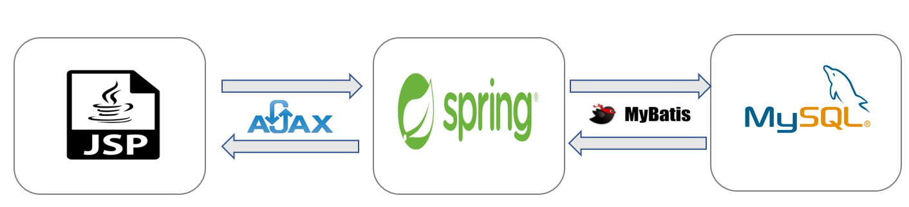
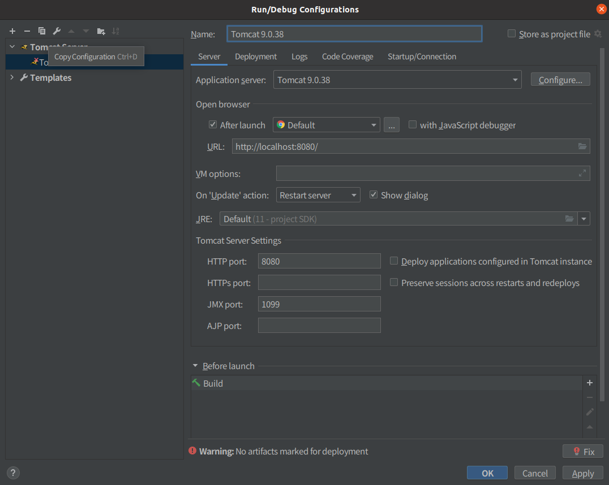
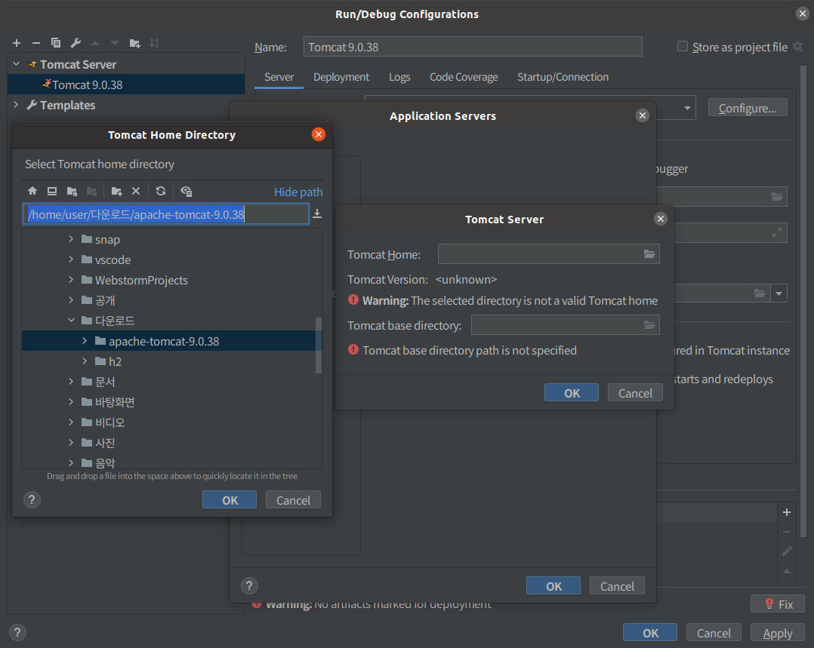
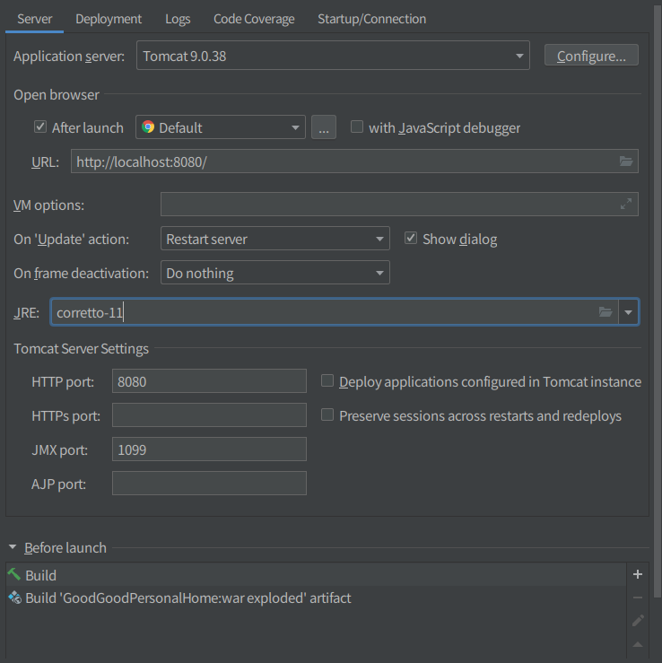
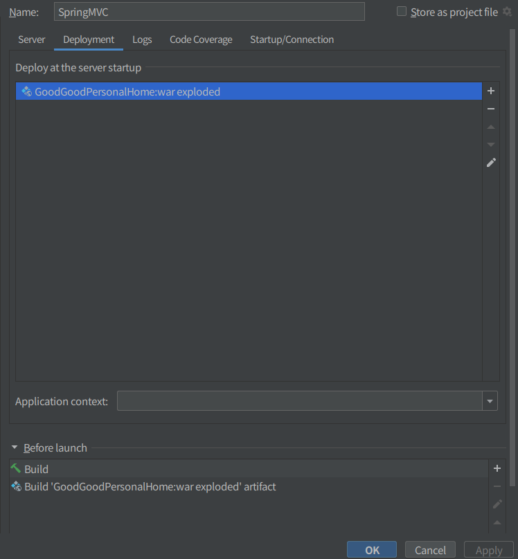
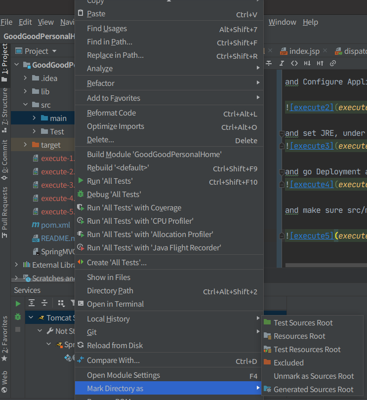

# GoodGoodPersonalHome

## Introduction
회원 가입, 로그인, 게시판 연동 구현을 목적으로 기획된 웹 서비스

## Technology
**JSP** **JQuery** **Ajax** **Spring** **MySQL**

### Architecture

---



### Version

---

|Project Environment|Version|
|:---:|:---:|
|`Spring`|4.3|
|`MYSQL`|8.0|
|`maven` |3.6.3|

### how to execute GoodGoodPersonalHome

```bash
git clone https://github.com/goodgood619/SpringMVC.git  
```

**Environment : Intellij IDEA** 

and then go Run/Debug Configurations, add Tomcat Server(Local), like below a picture


and Configure Application Server, and set tomcat path like a below picture



and set JRE, under Version openjdk 11, or 1.8


and go Deployment add war:exploded, please make sure empty ApplicationContext like below picture 


and make sure src/main as Source root



and last, Default MYSQL Schema is springtestdb  
tables : board, board_user, board_reply,board_rereply, board_menu, board_cellphone  
(I will upload DataBase Diagram later, Sorry)


### Use

---

1. first, http://localhost:8080/login/doinitLogin
2. and then signUp 
3. use board System 